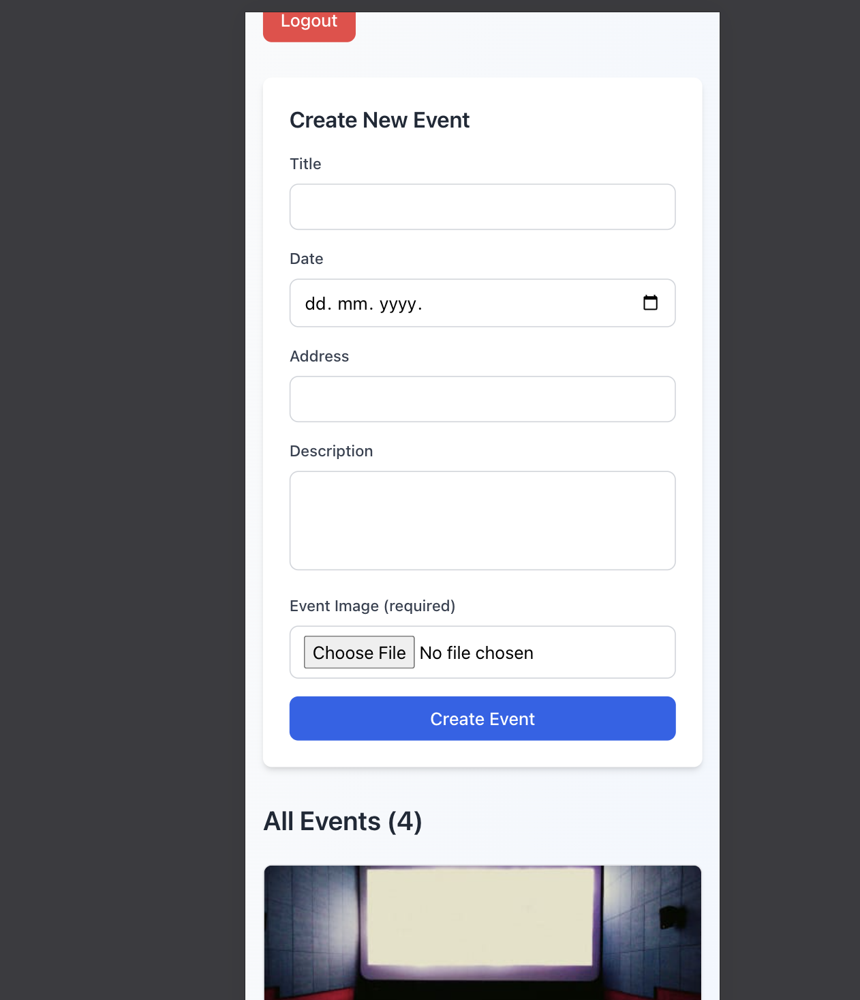

# 🎉 Event Manager

A modern, full-stack event management platform built with **React TypeScript** and **Node.js**. Create, discover, and manage events with a beautiful, responsive interface.

[](https://your-app.vercel.app)
[](https://your-api.railway.app)


## ✨ Key Features

### 🔐 **Authentication & Security**

- User registration and login with JWT tokens
- Secure password hashing with bcrypt
- Protected routes and automatic token validation
- Session persistence with localStorage

### 📅 **Event Management**

- Create events with title, description, location, and date
- Upload and manage event images (up to 5MB)
- View all events in a responsive grid layout
- Delete your own events with confirmation
- Real-time UI updates after all operations

### 🎨 **Modern User Experience**

- Clean, elegant design with subtle styling
- Loading states for all async operations
- Comprehensive error handling with user feedback
- Fully responsive design (mobile, tablet, desktop)
- Image fallbacks and lazy loading
- Intuitive, professional interface

### 🛡️ **Backend Security**

- SQL injection protection with prepared statements
- File upload validation (type, size, format)
- CORS configuration for secure requests
- Comprehensive input sanitization

## 🖼️ Screenshots

<details>
<summary>📱 Mobile & Desktop Views</summary>

| Mobile Login                        | Desktop Events Grid                   |
| ----------------------------------- | ------------------------------------- |
|  |  |

</details>

<details>
<summary>📝 Event Management</summary>

| Create Event                        | Event Card                      |
| ----------------------------------- | ------------------------------- |
|  |  |

</details>

## 🚀 Live Demo

**Frontend**: [https://your-event-manager.vercel.app](https://your-app.vercel.app)  
**Backend API**: [https://your-api.railway.app](https://your-api.railway.app)

### Demo Credentials

```
Email: demo@example.com
Password: demo123
```

## 🛠️ Tech Stack

### Frontend

- **React 19** - Latest React with concurrent features
- **TypeScript** - Type safety and enhanced DX
- **Tailwind CSS** - Utility-first styling
- **Vite** - Lightning-fast build tool
- **ESLint** - Code quality and consistency

### Backend

- **Node.js** - JavaScript runtime
- **Express.js** - Web application framework
- **TypeScript** - Full-stack type safety
- **SQLite** - Lightweight database
- **JWT** - Secure authentication
- **Multer** - File upload handling
- **bcryptjs** - Password encryption

## 📁 Project Structure

```
event-manager/
├── 🖥️ backend/              # Node.js API
│   ├── src/
│   │   ├── controllers/     # Business logic
│   │   ├── middleware/      # Auth & upload
│   │   ├── models/          # Data models
│   │   ├── routes/          # API endpoints
│   │   └── types/           # TypeScript types
│   └── public/images/       # Uploaded files
└── 🌐 frontend/             # React app
    ├── src/
    │   ├── components/      # React components
    │   ├── types/           # Shared types
    │   └── utils/           # API utilities
    └── dist/                # Built files
```

## 🚀 Quick Start

### Prerequisites

- Node.js 18+
- npm or yarn

### 1. Clone & Install

```bash
git clone https://github.com/yourusername/event-manager.git
cd event-manager
```

### 2. Backend Setup

```bash
cd backend
npm install
npm run dev  # Starts on http://localhost:3000
```

### 3. Frontend Setup

```bash
cd frontend
npm install
npm run dev  # Starts on http://localhost:5173
```

### 4. Environment Variables

Create `frontend/.env`:

```env
VITE_API_URL=http://localhost:3000
```

## 📚 API Documentation

### Authentication

```http
POST /users/signup    # Register new user
POST /users/login     # Authenticate user
```

### Events

```http
GET    /events        # Get all events (public)
POST   /events        # Create event (auth required)
DELETE /events/:id    # Delete event (owner only)
GET    /events/my     # Get user's events
```

### Static Files

```http
GET /images/:filename # Serve uploaded images
```

## 🌐 Deployment

### Backend (Railway)

```bash
cd backend
npm run build
# Deploy to Railway
```

### Frontend (Vercel)

```bash
cd frontend
npm run build
# Connect GitHub repo to Vercel
```

## ⚡ Performance Features

- **Image optimization** with lazy loading
- **Code splitting** with Vite
- **Efficient re-renders** with React hooks
- **Database indexing** for fast queries
- **Static file serving** with Express

## 🔧 Development

### Available Scripts

**Backend:**

```bash
npm run dev      # Development with hot reload
npm run build    # TypeScript compilation
npm start        # Production server
```

**Frontend:**

```bash
npm run dev      # Vite dev server
npm run build    # Production build
npm run preview  # Preview build locally
npm run lint     # ESLint checking
```

## 🤝 Contributing

1. Fork the repository
2. Create feature branch (`git checkout -b feature/amazing-feature`)
3. Commit changes (`git commit -m 'Add amazing feature'`)
4. Push to branch (`git push origin feature/amazing-feature`)
5. Open Pull Request

## 📄 License

This project is licensed under the MIT License .

---

**Built with ❤️ using modern web technologies**
